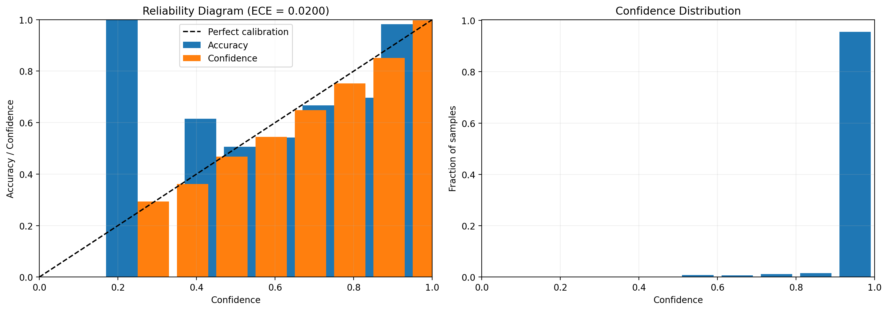
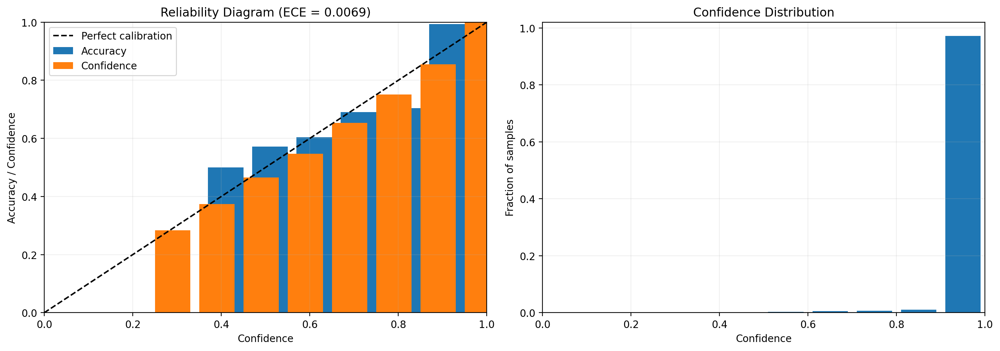

# Assignment 1 - Image Classification Report Content

This document is written for the `image` part of Assignment 1 and follows the required structure in the assignment specification:

1. Report on problem and dataset exploration (EDA)
2. Report on Dataset, DataLoader, and Augmentation setup
3. Report on model building, training, evaluation, and comparison
4. Experimental results report: tables; figures; analysis and discussion
5. Other extension reports (if any)

The work in this section is based on the following completed artifacts:

- Notebook: `../notebooks/cifar10_resnet18_transfer_learning.ipynb`
- Notebook: `../notebooks/cifar10_vit_transfer_learning.ipynb`
- Model: `../models/resnet18_cifar10.pth`
- Model: `../models/vit_b16_cifar10.pth`
- Calibration artifact: `../artifacts/cnn/resnet18_calibration_full.png`
- Calibration artifact: `../artifacts/vit/vit_b16_calibration_full.png`
- Web demo: `../../app/main.py`

---

## 1. Report on Problem and Dataset Exploration (EDA)

### 1.1 Problem statement

The image task in this assignment is a multi-class image classification problem. The goal is to classify each input image into one of the predefined semantic categories and to compare two major model families:

- `CNN`
- `ViT`

For this part, I selected:

- `ResNet-18` as the CNN-based model
- `ViT-B/16` as the Vision Transformer model

Both models were trained using transfer learning from ImageNet-pretrained weights and then evaluated on the same dataset for a fair comparison.

### 1.2 Dataset selection

The chosen dataset is `CIFAR-10`.

This dataset is appropriate for the assignment because:

- it has `10` classes, which satisfies the requirement of at least `5` classes,
- it is a standard benchmark for image classification,
- it is more meaningful than very simple datasets such as MNIST for comparing modern pretrained image models,
- and it is challenging enough to expose the strengths and weaknesses of both CNNs and Transformers.

### 1.3 Basic dataset statistics

- Dataset: `CIFAR-10`
- Number of classes: `10`
- Standard training split: `50,000` images
- Standard test split: `10,000` images
- Images per class in the test set: `1,000`
- Original image size: `32 x 32`

### 1.4 Class labels

The dataset contains the following 10 categories:

- airplane
- automobile
- bird
- cat
- deer
- dog
- frog
- horse
- ship
- truck

### 1.5 EDA observations

Even though CIFAR-10 is relatively small in image resolution, it still provides a useful benchmark because:

- it covers both `vehicle` and `animal` categories,
- some classes are visually easy to separate, such as `ship` and `truck`,
- while others are more visually similar and therefore harder, especially among animal classes.

From the confusion matrices and classification reports in the notebooks, the remaining classification errors are concentrated more in visually similar categories than in clearly distinguishable categories. This makes CIFAR-10 a good dataset for comparing representation quality and generalization behavior across CNN and ViT architectures.

### 1.6 Why CIFAR-10 is suitable for this project

For this assignment, the goal is not only to build a classifier but also to compare model families and extend the work with interpretability and calibration. CIFAR-10 supports all of these goals well:

- it is large enough to demonstrate transfer learning behavior,
- it is balanced enough to make model comparison straightforward,
- and it allows meaningful visualization and calibration analysis.

---

## 2. Report on Dataset, DataLoader, and Augmentation Setup

### 2.1 Dataset loading

Both notebooks use `torchvision.datasets.CIFAR10` to load the CIFAR-10 dataset.

The current pipeline uses:

- the standard CIFAR-10 training split for model optimization,
- the standard CIFAR-10 test split for evaluation and result reporting.

### 2.2 Common preprocessing design

Because both `ResNet-18` and `ViT-B/16` are ImageNet-pretrained models, the original CIFAR-10 images were resized from `32 x 32` to `224 x 224` before being fed into the networks.

Common preprocessing choices:

- resize input to `224 x 224`
- convert image to tensor
- normalize using CIFAR-10 statistics

Normalization values used in both notebooks:

- `mean = (0.4914, 0.4822, 0.4465)`
- `std = (0.2470, 0.2435, 0.2616)`

### 2.3 DataLoader setup

Both notebooks use PyTorch `DataLoader` with efficient loading settings:

- `batch_size = 64`
- `shuffle = True` for training
- `shuffle = False` for testing
- `num_workers = 4`
- `pin_memory = True`
- `persistent_workers = True`

This configuration helps maintain stable throughput during training and evaluation, especially when running in GPU environments such as Google Colab.

### 2.4 Augmentation for ResNet-18

Training transform used in the CNN notebook:

- `Resize((224, 224))`
- `RandomHorizontalFlip(p=0.5)`
- `ToTensor()`
- `Normalize(mean, std)`

Test transform used in the CNN notebook:

- `Resize((224, 224))`
- `ToTensor()`
- `Normalize(mean, std)`

This augmentation is intentionally simple. Horizontal flipping is appropriate for CIFAR-10, while normalization keeps the input distribution stable for transfer learning.

### 2.5 Augmentation for ViT-B/16

Training transform used in the ViT notebook:

- `Resize((224, 224))`
- `RandomHorizontalFlip()`
- `ToTensor()`
- `Normalize(mean, std)`

Test transform used in the ViT notebook:

- `Resize((224, 224))`
- `ToTensor()`
- `Normalize(mean, std)`

The augmentation policy remains lightweight here as well. This helps keep the comparison between CNN and ViT focused on architecture and fine-tuning strategy rather than on aggressive augmentation tricks.

### 2.6 Discussion of preprocessing choices

The resize step is important because the pretrained backbones were designed for ImageNet-scale inputs. Although CIFAR-10 images are low-resolution, resizing allows direct reuse of pretrained feature extractors. A limitation of this approach is that upsampling small images does not create new visual information, but in practice it still works well for transfer learning and produces strong classification performance.

---

## 3. Report on Model Building, Training, Evaluation, and Comparison

### 3.1 CNN model: ResNet-18

The CNN baseline is `ResNet-18`, initialized with ImageNet-pretrained weights.

Key design choices:

- model family: `CNN`
- backbone: `ResNet-18`
- initialization: pretrained on `ImageNet`
- final classification head replaced for `10` CIFAR-10 classes
- full fine-tuning enabled

Main training setup:

- `epochs = 30`
- `learning rate = 3e-4`
- `weight decay = 1e-4`
- `warmup epochs = 3`
- optimizer: `AdamW`
- scheduler: `LinearLR warmup + CosineAnnealingLR`

Parameter scale:

- total parameters: `11,181,642`

Training behavior:

- first epoch validation-style accuracy already reached `75.5%`
- best final reported test accuracy reached `96.55%`
- training time per epoch in the notebook was roughly `55 to 80 seconds`

### 3.2 ViT model: ViT-B/16

The Transformer-based model is `ViT-B/16`, also initialized with ImageNet-pretrained weights.

Key design choices:

- model family: `Vision Transformer`
- backbone: `ViT-B/16`
- initialization: pretrained on `ImageNet`
- final classification head replaced for `10` CIFAR-10 classes

The ViT training procedure uses a two-phase strategy:

- Phase 1: freeze the backbone and train only the classifier head
- Phase 2: unfreeze and fine-tune the full network

Main training setup:

- `batch_size = 64`
- `phase 1 epochs = 3`
- `phase 1 learning rate = 1e-3`
- `phase 2 epochs = 15`
- `phase 2 learning rate = 3e-5`
- `weight decay = 1e-4`
- optimizer: `AdamW`
- scheduler: `CosineAnnealingLR`

Parameter scale:

- total parameters: `85,806,346`

Training behavior:

- Phase 1 already reached about `95.32%`
- Phase 2 improved the model further to `98.36%`
- training time per epoch in the notebook was roughly `69 to 90 seconds`

### 3.3 Evaluation protocol

To compare the models fairly, both were evaluated on the same CIFAR-10 test set using:

- `accuracy`
- `classification report`
- `confusion matrix`

For the extension part, I also evaluated:

- `ECE (Expected Calibration Error)`
- `reliability diagram`

### 3.4 Comparison summary

| Model | Family | Params | Training Strategy | Final Test Accuracy | Macro F1 | ECE |
|---|---|---:|---|---:|---:|---:|
| ResNet-18 | CNN | 11.18M | Full fine-tuning, 30 epochs | `96.55%` | `0.97` | `0.020006` |
| ViT-B/16 | Transformer | 85.81M | Freeze 3 epochs + full fine-tune 15 epochs | `98.36%` | `0.98` | `0.006917` |

### 3.5 Main comparison takeaway

The comparison shows a clear trade-off:

- `ResNet-18` is much smaller and lighter,
- but `ViT-B/16` achieves better final accuracy and better calibration.

This makes the CNN model attractive as a more efficient baseline, while the ViT model is the stronger performer in final predictive quality.

---

## 4. Experimental Results Report: Tables, Figures, Analysis and Discussion

### 4.1 Main quantitative results

The final results indicate:

- `ResNet-18` achieved `96.55%` test accuracy
- `ViT-B/16` achieved `98.36%` test accuracy
- `ViT-B/16` also achieved lower calibration error (`ECE = 0.006917`) than `ResNet-18` (`ECE = 0.020006`)

This suggests that the ViT model is not only more accurate, but also more reliable in terms of confidence estimation.

### 4.2 Available figures in the repository

#### Calibration figure for ResNet-18

#### Calibration figure for ViT-B/16

### 4.3 Additional notebook figures used in analysis

The notebooks also contain:

- confusion matrix for `ResNet-18`
- confusion matrix for `ViT-B/16`
- full classification report for each model
- training curves

These figures are currently stored inside the notebooks and can be exported as screenshots or separate images when preparing the final GitHub Pages or slide deck.

### 4.4 Analysis and discussion

#### Accuracy comparison

Both models performed strongly on CIFAR-10, but `ViT-B/16` consistently achieved the best final result. This suggests that the Transformer model was able to learn stronger image-level representations after fine-tuning, despite having far more parameters than the CNN baseline.

#### Efficiency comparison

Although ViT produced the best accuracy, the CNN model remains valuable because:

- it is much smaller (`11.18M` vs `85.81M` parameters),
- and it trained faster per epoch in the notebook logs.

So, from a deployment perspective, `ResNet-18` offers a better accuracy-efficiency trade-off, while `ViT-B/16` offers the best absolute performance.

#### Error pattern discussion

Based on the confusion matrices and classification reports in the notebooks, the more difficult errors are concentrated in visually similar classes rather than in clearly distinct ones. This is expected for CIFAR-10, where some categories are semantically and visually close at low image resolution.

#### Calibration discussion

Calibration is an important extension because a model can be highly accurate but still poorly calibrated. In this project:

- `ResNet-18` ECE: `0.020006`
- `ViT-B/16` ECE: `0.006917`

The lower ECE of the ViT model indicates that its confidence estimates are better aligned with actual correctness. In other words, when the ViT model is confident, that confidence is more trustworthy on average.

#### Overall interpretation

The experiment supports the following overall conclusion:

- `ResNet-18` is a strong and efficient CNN baseline for CIFAR-10,
- `ViT-B/16` is the strongest model in final accuracy and calibration,
- and the difference is large enough to make the architecture comparison meaningful.

---

## 5. Other Extension Reports (if any)

For the image part, I implemented three extensions:

- `Application demo`
- `Interpretability`
- `Calibration`

### 5.1 Application demo

I built a simple web interface for the image models using Gradio.

Main features:

- upload an image,
- choose between `CNN` and `ViT`,
- run prediction,
- view top prediction output,
- visualize model explanation,
- inspect calibration output.

Main implementation file:

- `../../app/main.py`

This extension makes the project easier to demonstrate in a video or presentation because it turns the trained models into an interactive mini-application instead of just notebook outputs.

### 5.2 Interpretability

I added model explanation support for both architectures:

- `Grad-CAM` for `ResNet-18`
- attention-based visualization for `ViT-B/16`

This extension helps answer an important question:

- what regions of the image influenced the prediction?

Interpretability is especially useful for qualitative comparison because CNNs and Transformers often focus on image evidence differently.

### 5.3 Calibration

I implemented confidence calibration analysis using:

- `ECE`
- `reliability diagram`
- confidence distribution

The calibration outputs were exported from the notebooks and are also integrated into the web app. This allows the full-test calibration view to be shown quickly without recomputing the entire dataset every time.

### 5.4 Extension summary

The extension part for the image section is already complete and meaningfully strengthens the project:

- the `web demo` improves presentation quality,
- `interpretability` adds qualitative insight,
- and `calibration` adds reliability analysis beyond raw accuracy.

These extensions make the image section more complete and more aligned with the assignment's advanced grading criteria.

---

## Final Conclusion for the Image Section

The image part of Assignment 1 successfully compares two pretrained model families on CIFAR-10:

- `ResNet-18` as a CNN baseline
- `ViT-B/16` as a Transformer-based image model

The final results show that:

- both models are strong,
- `ViT-B/16` performs better overall,
- and the extension work provides additional depth through demo, interpretability, and calibration.

Therefore, the image section is complete not only as a classification experiment, but also as a polished project component that is ready to be presented on GitHub Pages, in a demo video, and in the final presentation slides.

