# Stanford Dogs Image Report Draft

This file is a running draft built directly from notebook outputs. New result batches can be appended here section by section.

## 1. Problem and Dataset Exploration (EDA)

### 1.1 Dataset overview

For the image classification track, we selected the **Stanford Dogs** dataset. This dataset is suitable for the assignment because it is a **fine-grained classification** benchmark with a relatively large number of classes and enough training samples to support a meaningful comparison between a CNN model and a Vision Transformer.

The dataset was loaded successfully from the official Stanford Dogs source, including the image archive and the provided train/test split lists. In total, the dataset contains **20,580 images** from **120 dog breeds**, with **12,000 training images** and **8,580 test images**.

| Metric | Value |
|---|---:|
| Dataset | Stanford Dogs |
| Total images | 20,580 |
| Official train samples | 12,000 |
| Official test samples | 8,580 |
| Number of classes | 120 |
| Minimum images per class | 148 |
| Maximum images per class | 252 |
| Mean images per class | 171.5 |

These statistics show that the dataset satisfies the assignment constraints well:

- it has far more than the minimum required **5 classes**,
- the training split is well above **5,000 samples**,
- and the task is non-trivial because many dog breeds are visually similar.

Although the class distribution is not perfectly uniform, it is still relatively balanced. The smallest class has **148 images** while the largest has **252 images**, which means there is only moderate class imbalance compared with many real-world fine-grained datasets.

### 1.2 Low-level image statistics

To better understand the visual properties of the dataset, we computed several low-level statistics from all images, including brightness, contrast, saturation, and average RGB channel intensity.

| Statistic | Count | Mean | Std | Min | 25% | 50% | 75% | Max |
|---|---:|---:|---:|---:|---:|---:|---:|---:|
| Brightness mean | 20,580 | 0.4522 | 0.1053 | 0.0803 | 0.3834 | 0.4533 | 0.5187 | 0.9326 |
| Contrast std | 20,580 | 0.2261 | 0.0524 | 0.0661 | 0.1903 | 0.2251 | 0.2599 | 0.4487 |
| Saturation mean | 20,580 | 0.3047 | 0.1389 | 0.0000 | 0.2021 | 0.2885 | 0.3892 | 0.9405 |
| R channel mean | 20,580 | 0.4761 | 0.1119 | 0.1047 | 0.4033 | 0.4744 | 0.5481 | 0.9383 |
| G channel mean | 20,580 | 0.4518 | 0.1091 | 0.0424 | 0.3803 | 0.4547 | 0.5230 | 0.9326 |
| B channel mean | 20,580 | 0.3910 | 0.1204 | 0.0296 | 0.3084 | 0.3857 | 0.4679 | 0.9188 |

These values suggest several important characteristics of the dataset:

- The average **brightness** is around **0.45**, indicating that most images are moderately lit rather than extremely dark or overexposed.
- The brightness range is wide (**0.08 to 0.93**), which confirms that the dataset contains images captured under diverse lighting conditions.
- The average **contrast** is moderate, meaning object boundaries and fur textures are usually visible, but not always equally sharp across all samples.
- The average **saturation** is relatively low to medium (**0.30**), which is reasonable because many dog images contain natural outdoor backgrounds, neutral indoor scenes, or fur colors with limited chromatic intensity.
- The RGB means follow the pattern **R > G > B**, suggesting that the dataset slightly favors warm tones overall. This is consistent with common dog fur colors and outdoor image environments such as grass, soil, and sunlight.

Overall, these statistics indicate that Stanford Dogs is visually diverse in terms of illumination, color composition, and image quality. This diversity makes the classification task more realistic and supports the use of transfer learning with both **ResNet-18** and **ViT-B/16**.

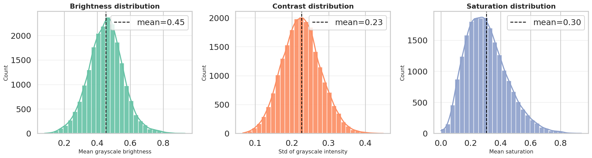

*Figure 1. Brightness, contrast, and saturation distributions across the Stanford Dogs dataset. The brightness distribution is centered around 0.45, the contrast distribution around 0.23, and the saturation distribution around 0.30, indicating a moderately lit and moderately colorful dataset with clear visual variation.*

### 1.3 Breed-level quality variation

To understand whether image appearance differs across breeds, we also compared brightness and saturation across a selected subset of dog classes. The boxplots show that the median brightness and saturation values vary across breeds, but most classes still fall within a relatively similar range. This suggests that while some breeds appear more frequently in brighter outdoor scenes or more colorful settings, the variation is not extreme enough to create obvious low-level shortcuts for classification.

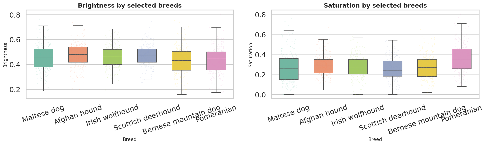

*Figure 2. Brightness and saturation distributions across selected dog breeds. The interquartile ranges and whiskers indicate moderate within-class variability, while the slight differences between breeds reflect diverse capture conditions rather than strong class-specific biases.*

### 1.4 RGB channel composition

We also summarized the average RGB channel intensity across the full dataset to better understand its overall color composition.

| Channel | Mean | Std of image means |
|---|---:|---:|
| R | 0.4761 | 0.1119 |
| G | 0.4518 | 0.1091 |
| B | 0.3910 | 0.1204 |

The RGB analysis confirms that the dataset has a slightly warm visual bias, with the **red channel** showing the highest average intensity and the **blue channel** the lowest. This pattern is consistent with common dog-fur colors, soil, wood, and other natural outdoor elements that appear frequently in the dataset. At the same time, the standard deviation of per-image means is fairly similar across channels, with the blue channel showing the largest variation. This suggests that while the global color tone is slightly warm, the dataset still contains diverse scene conditions and background compositions.

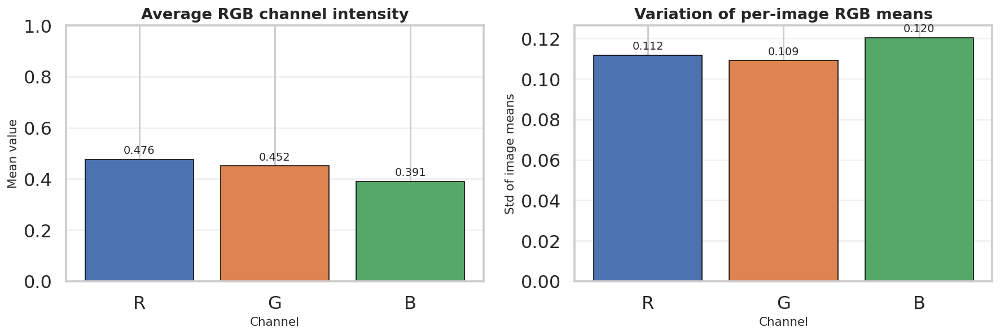

*Figure 3. Average RGB channel intensity and variation of per-image RGB means. The red channel is slightly more dominant overall, while the blue channel shows the highest variability across images.*

### 1.5 Extreme brightness examples

To complement the summary statistics, we also inspected the darkest and brightest images in the dataset. This helps verify that the measured brightness range corresponds to meaningful visual variation rather than only small numerical differences.

The darkest examples are mostly low-light indoor images, shadow-heavy scenes, or photos with strong exposure limitations. In several cases, the dog occupies only part of the frame or blends into a dark background, which makes recognition harder even for humans. These samples are useful for motivating brightness-robust preprocessing and augmentation.

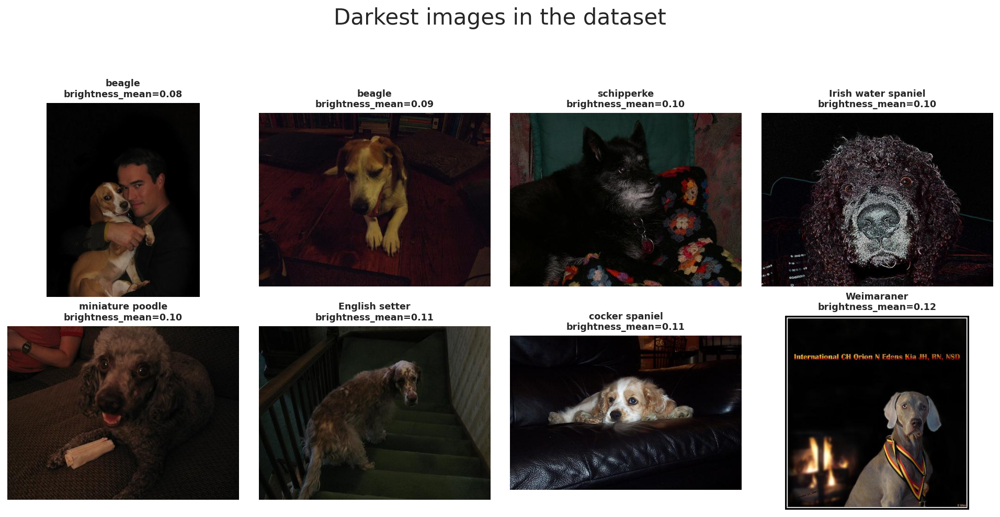

*Figure 4. The darkest images in the Stanford Dogs dataset. These samples illustrate challenging low-light conditions, dark backgrounds, and reduced visibility of breed-specific features.*

In contrast, the brightest examples are dominated by white backgrounds, studio-style images, or breeds with very bright fur. These samples show that the dataset also contains high-exposure, low-shadow conditions where shape cues remain visible but texture and boundary contrast may become less informative.

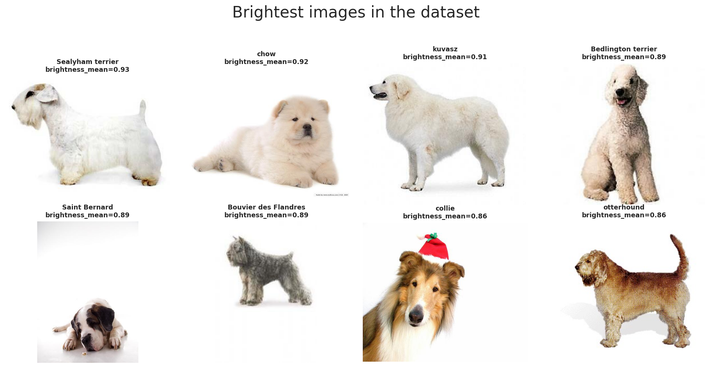

*Figure 5. The brightest images in the Stanford Dogs dataset. Many of these samples contain bright fur or nearly white backgrounds, showing the opposite end of the dataset’s illumination range.*

Together, these two galleries confirm that Stanford Dogs includes substantial illumination diversity. This reinforces the need for normalization and moderate augmentation so that both CNN and ViT models learn breed features that remain stable under different lighting conditions.

### 1.6 Official split and breed distribution

Beyond low-level image quality, we also examined how the dataset is distributed across the official train/test split and across breed classes. The official split remains reasonably large for both phases, with **12,000 training images** and **8,580 test images**, which is sufficient for fine-tuning modern pretrained models while still preserving a substantial held-out test set.

At the class level, the top-20 breeds by image count remain relatively close to one another, with no breed overwhelmingly dominating the dataset. This observation is consistent with the earlier summary statistics showing only moderate imbalance across classes. As a result, the dataset is challenging mainly because of **fine-grained inter-class similarity**, not because of severe class-frequency skew.

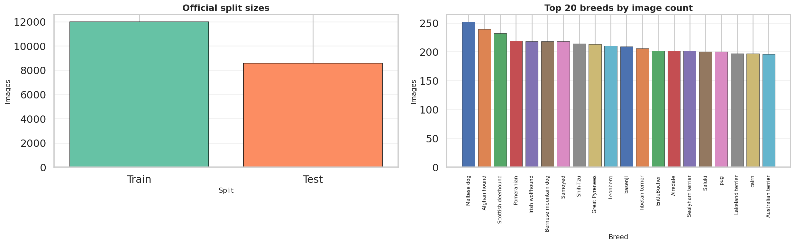

*Figure 6. Official train/test split sizes and the top-20 breeds by image count. The split is sufficiently large for training and evaluation, while breed frequencies remain relatively balanced.*

### 1.7 Image size and aspect ratio distribution

We also inspected the raw image dimensions before preprocessing. The width and height distributions show that Stanford Dogs contains images of varying resolutions, with an average width of approximately **442.5 pixels** and an average height of approximately **385.9 pixels**. The aspect-ratio distribution is centered around **1.19**, which indicates that images are, on average, slightly wider than they are tall.

This variation matters for model preparation because neither ResNet-18 nor ViT-B/16 can consume raw images with inconsistent spatial sizes directly. Therefore, a consistent resizing pipeline is necessary. At the same time, the moderate spread in aspect ratios suggests that center-crop or resize-based preprocessing must be chosen carefully to avoid removing important breed-specific cues such as ear shape, tail shape, or overall body proportions.

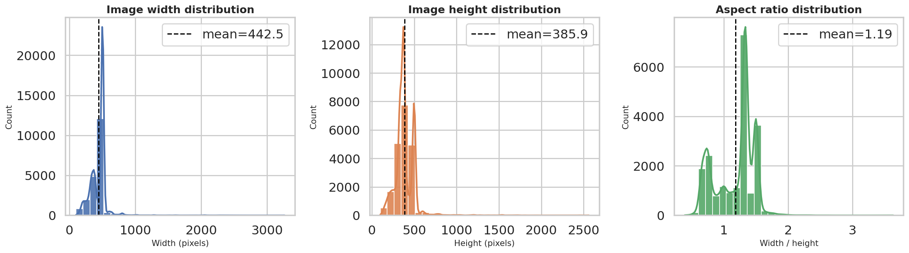

*Figure 7. Distributions of image width, image height, and aspect ratio. Stanford Dogs contains non-uniform image sizes, which justifies standardized resizing before model training.*

### 1.8 Random breed samples

Finally, we visualized a random set of breed examples from both the training and test splits. These samples illustrate that the dataset contains broad variation in:

- pose and viewpoint,
- background clutter,
- lighting conditions,
- dog scale within the frame,
- and the presence of other objects or people.

This gallery reinforces why Stanford Dogs is a meaningful benchmark for the assignment. Even though all images contain dogs, the classification problem is not trivial because the model must distinguish between many visually similar breeds under varied real-world capture conditions.

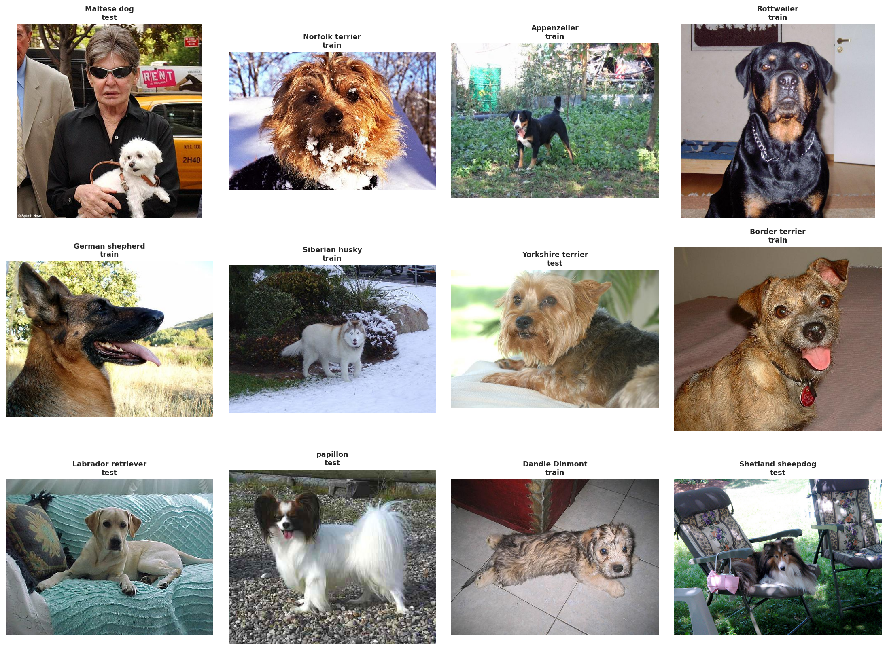

*Figure 8. Random breed examples from the official train and test splits. The samples highlight the large diversity in pose, scale, background, and capture conditions across the dataset.*

## 2. Dataset, DataLoader, and Augmentation Setup

### 2.1 Split strategy and class balance

After loading the official Stanford Dogs split, we further divided the official training set into an internal **train/validation split** for model selection. This produced the following final split sizes:

| Split | Images | Classes | Min class count | Max class count |
|---|---:|---:|---:|---:|
| Train | 10,200 | 120 | 85 | 85 |
| Val | 1,800 | 120 | 15 | 15 |
| Test | 8,580 | 120 | 48 | 152 |

This result confirms that the internal validation split was successfully stratified. Both the training set and validation set are perfectly balanced across all 120 breeds, while the official test set retains its original distribution. This setup is desirable for the assignment because:

- it preserves the official benchmark test split for final evaluation,
- it avoids leakage from test data into model selection,
- and it gives both ResNet-18 and ViT-B/16 exactly the same data partitions for a fair comparison.

### 2.2 DataLoader construction

We constructed separate DataLoaders for the CNN and Transformer pipelines, but both use the same train/validation/test partitions. The resulting numbers of batches are:

| Model pipeline | Train loaders | Val loaders | Test loaders |
|---|---:|---:|---:|
| ResNet-18 | 319 | 57 | 269 |
| ViT-B/16 | 319 | 57 | 269 |

The matching loader counts confirm that the two models are trained and evaluated under the same effective data volume. The only intended difference lies in their preprocessing and augmentation design, not in the underlying sample split.

### 2.3 Preprocessing design

The preprocessing pipeline was designed to be compatible with ImageNet-pretrained backbones while preserving enough breed-specific structure for fine-grained classification.

| Component | Design | Reason |
|---|---|---|
| Resize / crop | Resize to 256 then crop to 224 | Match pretrained backbone input size while preserving the main dog region clearly enough for classification |
| Normalization | ImageNet mean/std | Compatible with pretrained ResNet-18 and ViT-B/16 weights |
| ResNet augmentation | RandomResizedCrop + flip + rotation + color jitter + erasing | Improve robustness to pose, scale, illumination, and partial occlusion in dog photos |
| ViT augmentation | Milder crop + flip + color jitter + erasing | Keep augmentation moderate while still improving generalization on fine-grained breed differences |
| Split strategy | Official train/test split with internal stratified validation split from train only | Preserve the benchmark test set while keeping the training pool comfortably above the assignment size threshold |

This design reflects a balance between robustness and fine-grained detail preservation. ResNet-18 benefits from stronger geometric augmentation because convolutional models often improve when exposed to more spatial variation. For ViT-B/16, the augmentation is intentionally milder so that breed-level appearance cues are not distorted too aggressively during fine-tuning.

### 2.4 Augmented batch preview

The augmented batch preview confirms that the pipeline produces realistic but non-trivial variations of the training images. We observe random cropping, slight rotation, horizontal flipping, illumination changes, and partial erasing effects, while the core dog region remains recognizable. This is important because the task requires the model to remain sensitive to subtle breed-level features without overfitting to fixed poses or backgrounds.

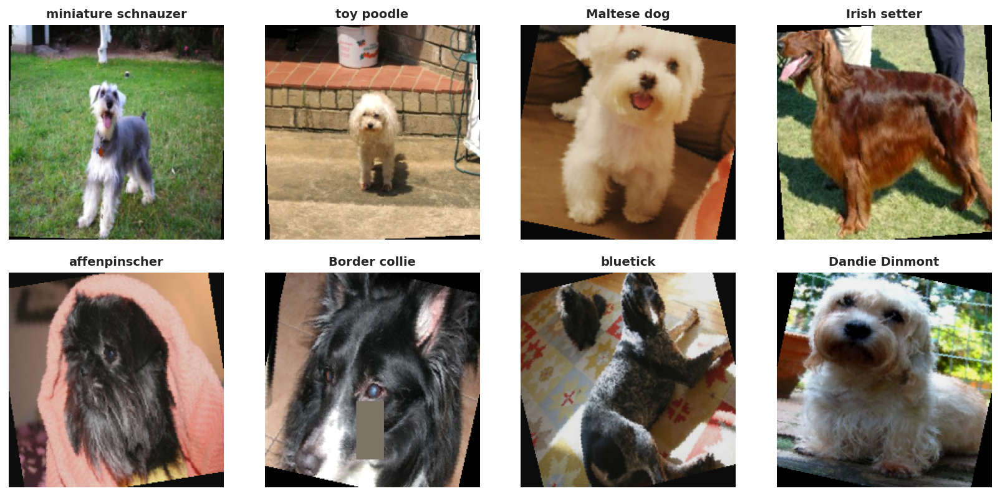

*Figure 9. Example training images after augmentation. The transformations increase visual diversity while preserving the main breed identity, which supports stronger generalization for both ResNet-18 and ViT-B/16.*

## 3. Model Building, Training, Evaluation, and Comparison

### 3.1 ResNet-18 baseline

For the CNN baseline, we used **ResNet-18** initialized with ImageNet-pretrained weights and replaced the final classification head to match the **120 Stanford Dogs classes**. The resulting model contains **11,238,072 parameters**, making it a relatively compact and efficient baseline compared with the Vision Transformer model used later.

The notebook successfully loaded an existing ResNet-18 checkpoint before evaluation, indicating that the training stage had already been completed and the best saved model was reused for further analysis.

### 3.2 ResNet-18 training dynamics

The training log from the final epochs is summarized below:

| Stage | Epoch | Train loss | Train acc | Val loss | Val acc | Val macro F1 | LR |
|---|---:|---:|---:|---:|---:|---:|---:|
| stanforddogs_resnet18 | 8 | 0.3975 | 0.8931 | 1.0092 | 0.7044 | 0.7018 | 0.000104 |
| stanforddogs_resnet18 | 9 | 0.2769 | 0.9341 | 0.9461 | 0.7289 | 0.7267 | 0.000062 |
| stanforddogs_resnet18 | 10 | 0.2216 | 0.9515 | 0.9157 | 0.7417 | 0.7412 | 0.000029 |
| stanforddogs_resnet18 | 11 | 0.1750 | 0.9640 | 0.9074 | 0.7461 | 0.7466 | 0.000007 |
| stanforddogs_resnet18 | 12 | 0.1616 | 0.9701 | 0.8996 | 0.7489 | 0.7482 | 0.000000 |

Several trends are visible from these results:

- the training loss decreases steadily from **0.3975** to **0.1616**,
- the training accuracy increases from **89.31\%** to **97.01\%**,
- the validation accuracy improves more gradually from **70.44\%** to **74.89\%**,
- and the validation macro F1 follows a similar pattern, reaching **0.7482** at the final epoch.

These results suggest that ResNet-18 learns the training set well, but the gap between training accuracy and validation accuracy indicates that the model still faces a meaningful generalization challenge on this fine-grained breed-classification task. This is expected for Stanford Dogs, where many classes differ only through subtle facial, fur, and body-structure cues.

### 3.3 ResNet-18 artifacts

All ResNet-18 outputs were exported under the CNN artifact directory:

- `assignments/assignment-1/image/artifacts/stanford_dogs/cnn/`

This directory contains the saved evaluation assets used later in the report, such as confusion matrices, calibration plots, misclassified examples, and interpretability visualizations. Keeping all CNN outputs in a dedicated subfolder makes the comparison with the ViT-based pipeline clearer and easier to reproduce.

### 3.4 ResNet-18 test performance

The final ResNet-18 test metrics are:

| Model | Accuracy | Macro F1 | Weighted F1 |
|---|---:|---:|---:|
| ResNet-18 | 0.7273 | 0.7193 | 0.7283 |

These results show that ResNet-18 provides a meaningful CNN baseline on Stanford Dogs, but the performance is still limited by the fine-grained nature of the task. The model performs reasonably well overall, yet it does not fully resolve the subtle visual differences between closely related breeds.

To illustrate this more concretely, the classification report for several breeds is shown below:

| Class | Precision | Recall | F1-score | Support |
|---|---:|---:|---:|---:|
| Chihuahua | 0.6538 | 0.6538 | 0.6538 | 52 |
| Japanese spaniel | 0.8488 | 0.8588 | 0.8538 | 85 |
| Maltese dog | 0.8750 | 0.7829 | 0.8264 | 152 |
| Pekinese | 0.7308 | 0.7755 | 0.7525 | 49 |
| Shih-Tzu | 0.6900 | 0.6053 | 0.6449 | 114 |

This subset of class-wise results suggests that the model handles some visually distinctive small-breed classes relatively well, but performance becomes less stable when breeds have overlapping fur texture, face shape, or body proportions.

### 3.5 ResNet-18 confusion-matrix analysis

The **count-based confusion matrix** (`resnet_18_confusion_matrix_counts.png`) shows where prediction errors are concentrated in absolute terms, while the **row-normalized confusion matrix** (`resnet_18_confusion_matrix_normalized.png`) highlights which classes are most frequently confused relative to their own support. Together, these two views are important:

- the count-based version emphasizes high-volume error patterns,
- the normalized version reveals difficult classes even when they have fewer test samples.

For a fine-grained dataset such as Stanford Dogs, this pair of matrices is more informative than overall accuracy alone because many errors occur between semantically close breeds rather than between obviously different classes.

### 3.6 ResNet-18 calibration

The calibration artifact `resnet18_calibration.png` shows that ResNet-18 achieves:

- **ECE = 0.0394**

This is reasonably good, but it also indicates that the model is somewhat **overconfident** in part of its prediction range. The reliability diagram shows that predicted confidence and empirical accuracy are not perfectly aligned, especially in higher-confidence bins. In other words, the model may assign very high confidence to some predictions even when those predictions are not always correct.

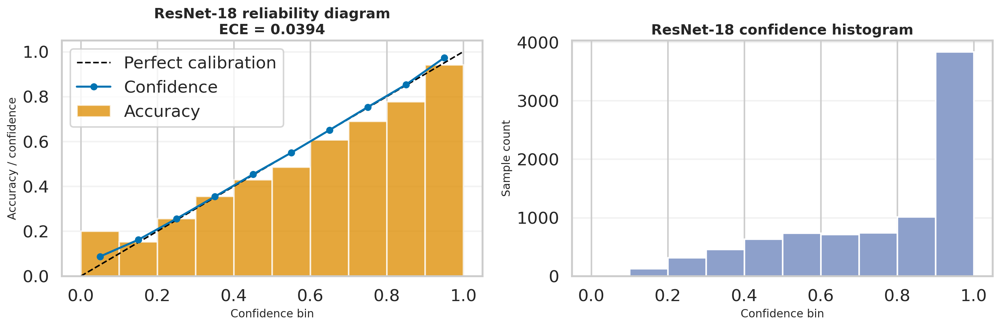

*Figure 10. ResNet-18 reliability diagram and confidence histogram. The model is fairly well calibrated overall, but still exhibits some overconfidence compared with an ideal perfectly calibrated predictor.*

### 3.7 ResNet-18 interpretability with Grad-CAM

The artifact `resnet18_gradcam_gallery.png` provides Grad-CAM visualizations for several correctly and incorrectly classified examples. These heatmaps help reveal which regions of the image contribute most strongly to the CNN decision.

In the clearer examples, the activation focuses on the dog’s face, torso, or distinctive fur region, which suggests that the model is learning semantically meaningful visual evidence. However, in some harder cases, the highlighted area spreads into background or scene context, implying that the model may still rely partially on environmental cues rather than purely breed-defining structure.

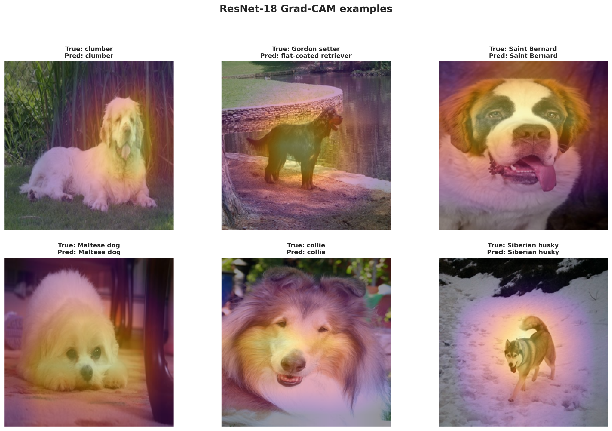

*Figure 11. Grad-CAM examples for ResNet-18. The heatmaps show that the model often attends to the dog body and facial region, but sometimes also uses surrounding scene context when making predictions.*

### 3.8 ResNet-18 misclassified examples

The artifact `resnet18_misclassified_gallery.png` is useful for qualitative error analysis. It shows representative test images that the model predicted incorrectly, often with high confidence. In a fine-grained setting, these errors are expected because several dog breeds differ only in subtle details such as muzzle shape, ear length, fur texture, or body proportion.

This gallery helps explain why overall accuracy remains below the ViT-based approach: the CNN baseline can capture many coarse patterns well, but it still struggles on borderline cases where local texture and global breed structure must both be resolved precisely.

### 3.9 Summary of the ResNet-18 baseline

Overall, ResNet-18 serves as a strong and computationally efficient baseline, but its test performance confirms the difficulty of the Stanford Dogs dataset. The model learns meaningful dog-centric visual cues and reaches acceptable calibration, yet the confusion patterns and misclassified gallery indicate that fine-grained breed recognition remains challenging for a comparatively small CNN backbone.

### 3.10 ViT-B/16 baseline

For the Transformer-based model, we used **ViT-B/16** with ImageNet-pretrained weights and a classification head adapted to the **120 Stanford Dogs classes**. The model contains **85,890,936 parameters**, making it substantially larger than ResNet-18. This larger capacity is expected to benefit fine-grained recognition, where subtle spatial relationships and global breed structure matter more strongly.

The notebook successfully loaded an existing ViT-B/16 checkpoint before evaluation, so the reported results correspond to a saved trained model rather than a partially trained run.

### 3.11 ViT-B/16 training dynamics

The final epochs of the full fine-tuning stage are summarized below:

| Stage | Epoch | Train loss | Train acc | Val loss | Val acc | Val macro F1 | LR | Epoch total |
|---|---:|---:|---:|---:|---:|---:|---:|---:|
| stanforddogs_vit_full | 4 | 0.0577 | 0.9851 | 0.2533 | 0.9239 | 0.9233 | 0.000015 | 7 |
| stanforddogs_vit_full | 5 | 0.0380 | 0.9914 | 0.2323 | 0.9350 | 0.9349 | 0.000009 | 8 |
| stanforddogs_vit_full | 6 | 0.0295 | 0.9927 | 0.2249 | 0.9372 | 0.9368 | 0.000004 | 9 |
| stanforddogs_vit_full | 7 | 0.0278 | 0.9931 | 0.2234 | 0.9372 | 0.9369 | 0.000001 | 10 |
| stanforddogs_vit_full | 8 | 0.0233 | 0.9943 | 0.2210 | 0.9394 | 0.9391 | 0.000000 | 11 |

These numbers show a strong and stable convergence pattern:

- the training loss is already very low in the final stage and continues decreasing,
- the training accuracy rises above **99\%**,
- the validation accuracy reaches **93.94\%**,
- and the validation macro F1 remains almost identical to the validation accuracy, indicating balanced performance across breeds.

Compared with the ResNet baseline, the ViT model generalizes much better to the validation set. This suggests that self-attention and the larger representational capacity of ViT-B/16 are particularly helpful for distinguishing highly similar dog breeds.

### 3.12 ViT-B/16 test performance

The final ViT-B/16 test metrics are:

| Model | Accuracy | Macro F1 | Weighted F1 |
|---|---:|---:|---:|
| ViT-B/16 | 0.9378 | 0.9343 | 0.9378 |

This is a substantial improvement over ResNet-18 and confirms that the Transformer-based approach is much better suited to the fine-grained Stanford Dogs task.

For several representative breeds, the class-wise results are:

| Class | Precision | Recall | F1-score | Support |
|---|---:|---:|---:|---:|
| Chihuahua | 0.8750 | 0.9423 | 0.9074 | 52 |
| Japanese spaniel | 0.9512 | 0.9176 | 0.9341 | 85 |
| Maltese dog | 0.9862 | 0.9408 | 0.9630 | 152 |
| Pekinese | 0.9057 | 0.9796 | 0.9412 | 49 |
| Shih-Tzu | 0.8689 | 0.9298 | 0.8983 | 114 |

Relative to the ResNet baseline, every one of these sample classes improves noticeably. This indicates that ViT-B/16 is not only improving average performance, but is also more robust on visually similar small-breed categories that are typically difficult to separate.

### 3.13 ViT-B/16 artifacts

All ViT-B/16 outputs were exported under the Transformer artifact directory:

- `assignments/assignment-1/image/artifacts/stanford_dogs/vit/`

This folder contains the model’s evaluation figures and diagnostic outputs, including confusion matrices, calibration plots, attention visualizations, and a gallery of highly confident mistakes.

### 3.14 ViT-B/16 confusion-matrix analysis

The ViT confusion matrices show a much sharper diagonal structure than the ResNet baseline, which immediately indicates fewer errors across most breeds.

The **count-based confusion matrix** (`vit_b_16_confusion_matrix_counts.png`) highlights the overall concentration of correct predictions, while the **row-normalized confusion matrix** (`vit_b_16_confusion_matrix_normalized.png`) reveals that many breed classes are recognized with consistently high per-class recall. Remaining mistakes still cluster around breed pairs with very similar coat texture, size, or head shape, but the volume of confusion is much lower than for the CNN model.

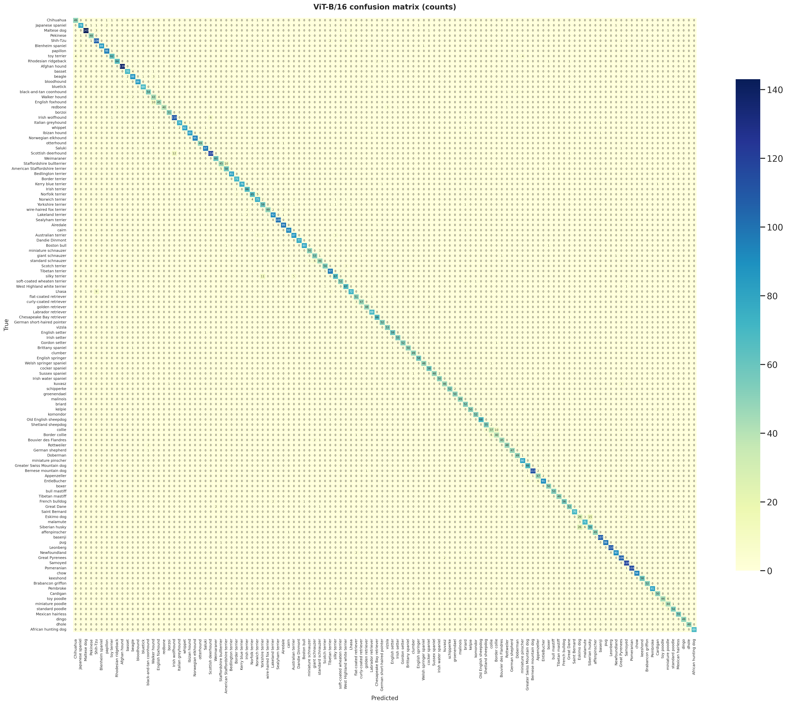

*Figure 12. Count-based confusion matrix for ViT-B/16. The strong diagonal dominance indicates that the model predicts most breeds correctly, with relatively limited off-diagonal confusion.*

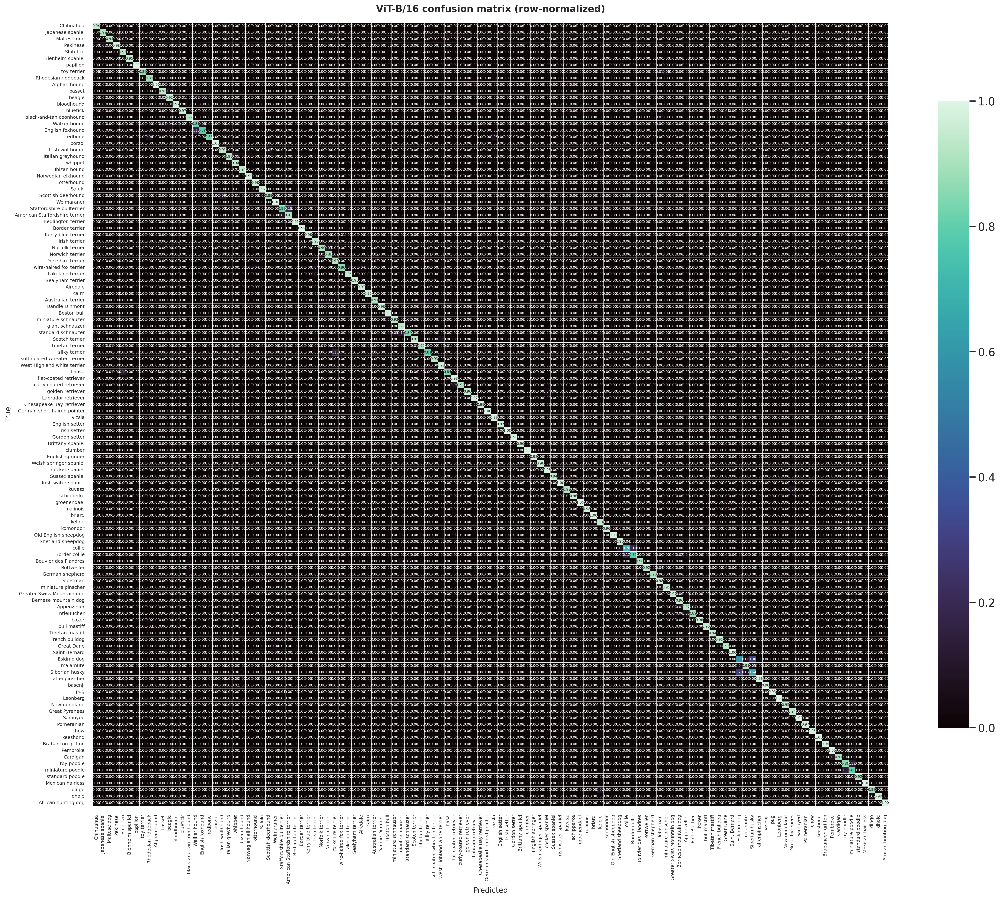

*Figure 13. Row-normalized confusion matrix for ViT-B/16. Many classes maintain high per-class recall, showing that the improved performance is broadly distributed across breeds rather than concentrated in only a few easy classes.*

### 3.15 ViT-B/16 calibration

The calibration artifact `vit_b16_calibration.png` shows:

- **ECE = 0.0161**

This is clearly better than ResNet-18 (**0.0394**), meaning that ViT-B/16 not only predicts more accurately, but also produces confidence scores that align more closely with its actual correctness. The reliability diagram stays nearer to the perfect-calibration line, and the confidence histogram shows that many predictions fall into the very-high-confidence region without suffering the same degree of overconfidence as the CNN baseline.

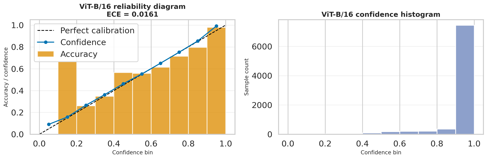

*Figure 14. ViT-B/16 reliability diagram and confidence histogram. The lower ECE indicates better calibration, so the model’s confidence scores are more trustworthy overall.*

### 3.16 ViT-B/16 attention visualization

The artifact `vit_b16_attention_gallery.png` provides attention-based interpretability examples for the Transformer model. Unlike Grad-CAM, which highlights activation regions from convolutional layers, this gallery visualizes how the Vision Transformer attends to image regions that are important for classification.

These attention maps are useful for showing that the model often concentrates on semantically meaningful breed cues such as the face, torso outline, ear shape, and fur region. This supports the hypothesis that ViT-B/16 can represent global structure and long-range visual relationships more effectively than the CNN baseline.

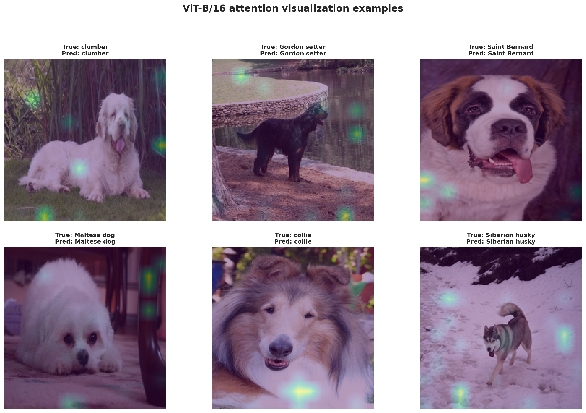

*Figure 15. Attention visualization examples for ViT-B/16. The model tends to focus on breed-relevant regions, especially the dog body and facial structure, which helps explain its strong fine-grained classification performance.*

### 3.17 ViT-B/16 misclassified examples

The artifact `vit_b16_misclassified_gallery.png` shows representative mistakes made by the Transformer model. Even though the overall accuracy is high, the remaining failures are highly informative: most of them involve breed pairs that are genuinely hard to separate visually, and many are predicted with very high confidence.

This pattern shows that the remaining errors are not random. Instead, they correspond to some of the most difficult fine-grained distinctions in the dataset, such as closely related black-coated breeds or small terrier-like classes with similar body shape and fur structure.

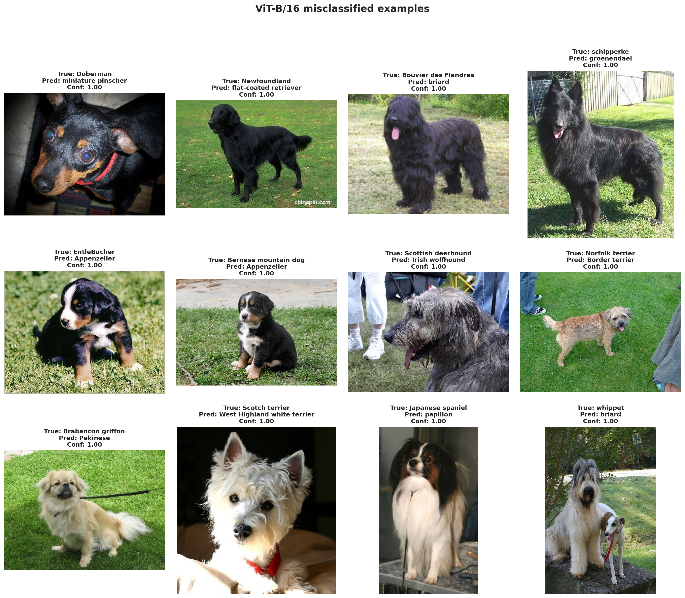

*Figure 16. Misclassified examples for ViT-B/16. Even the remaining mistakes are usually visually plausible confusions between closely related dog breeds, which reflects the fine-grained nature of the task.*

### 3.18 Summary of the ViT-B/16 baseline

Overall, ViT-B/16 delivers a very strong result on Stanford Dogs. It improves substantially over ResNet-18 in validation accuracy, test accuracy, macro F1, and calibration quality. The confusion matrices, attention visualizations, and misclassified gallery all indicate that the Transformer model is better able to capture subtle breed-level structure across diverse real-world images.

## 4. Experimental Results, Figures, Analysis, and Discussion

### 4.1 Overall comparison table

The final comparison between the CNN baseline and the Transformer model is summarized below:

| Model | Family | Params | Training strategy | Test accuracy | Macro F1 | Weighted F1 | ECE | Train time (s) | Params (M) |
|---|---|---:|---|---:|---:|---:|---:|---:|---:|
| ResNet-18 | CNN | 11,238,072 | Full fine-tuning for 12 epochs | 0.7273 | 0.7193 | 0.7283 | 0.0394 | 166.10 | 11.2381 |
| ViT-B/16 | Transformer | 85,890,936 | Head 3 + full fine-tune 8 epochs | 0.9378 | 0.9343 | 0.9378 | 0.0161 | 318.85 | 85.8909 |

This table shows a very clear outcome: **ViT-B/16 strongly outperforms ResNet-18 on Stanford Dogs across all major evaluation metrics**. The Transformer model achieves much higher test accuracy and macro F1, while also producing better-calibrated confidence scores. The main trade-off is computational cost, since ViT-B/16 has far more parameters and requires a longer training time.

### 4.2 Comparison overview figure

The comparison figure highlights the three most important summary metrics: **test accuracy**, **macro F1**, and **calibration error (ECE)**.

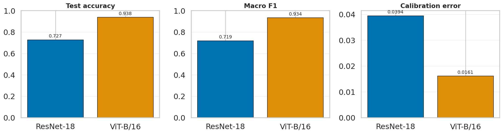

*Figure 17. Side-by-side comparison of ResNet-18 and ViT-B/16 on Stanford Dogs. ViT-B/16 achieves much higher predictive performance and lower calibration error.*

### 4.3 Accuracy and F1 discussion

From the final test results:

- ResNet-18 reaches **72.73\%** test accuracy and **0.7193** macro F1,
- ViT-B/16 reaches **93.78\%** test accuracy and **0.9343** macro F1.

The improvement is very large and consistent across both overall accuracy and class-balanced performance. This indicates that ViT-B/16 does not merely perform better on a few dominant breeds; instead, it improves recognition quality broadly across the dataset.

The large accuracy gap also aligns with the qualitative findings from the confusion matrices and misclassified galleries:

- ResNet-18 often struggles on visually similar breeds,
- ViT-B/16 preserves much better separability across fine-grained classes,
- and the Transformer errors that remain are mostly limited to especially difficult breed pairs.

### 4.4 Calibration and confidence discussion

Calibration is also an important dimension of model quality, especially when a classifier is expected to produce confidence scores that can be trusted.

- ResNet-18: **ECE = 0.0394**
- ViT-B/16: **ECE = 0.0161**

The lower ECE of ViT-B/16 means that its predicted confidence is more closely aligned with empirical correctness. This matters because a model with strong accuracy but poor calibration can still be misleading in downstream use. In this experiment, ViT-B/16 is not only more accurate, but also more reliable in how it expresses uncertainty.

### 4.5 Efficiency and trade-off discussion

Although ViT-B/16 achieves the best performance, the comparison also shows a clear efficiency trade-off:

- ResNet-18 has only **11.24M parameters** and trains in about **166 seconds**,
- ViT-B/16 has **85.89M parameters** and trains in about **319 seconds**.

Therefore, the CNN baseline remains attractive if computational efficiency is a stronger constraint than absolute accuracy. However, if the objective is to maximize classification quality on a fine-grained benchmark like Stanford Dogs, the Transformer model is clearly the better choice.

### 4.6 Final interpretation

Overall, the experimental results support the following conclusions:

- **Stanford Dogs is a challenging fine-grained benchmark**, where subtle breed differences expose the limitations of smaller CNN baselines.
- **ResNet-18** is lightweight and reasonably effective, but its performance is limited by the difficulty of the task.
- **ViT-B/16** is substantially more effective because it captures both local detail and broader visual structure more successfully.
- The Transformer model also shows **better calibration**, which strengthens its practical reliability beyond raw accuracy alone.

Taken together, the results demonstrate that for this assignment setting, the Transformer-based model is the stronger choice for fine-grained dog-breed classification, while ResNet-18 remains a useful efficiency-oriented reference baseline.

## 5. Extension Reports

The interpretability and qualitative error-analysis extensions were already discussed in the model sections above through:

- **Grad-CAM** for ResNet-18,
- **attention visualization** for ViT-B/16,
- and the **misclassified-example galleries** for both models.

In this section, we focus on the two remaining quantitative extensions:

- **augmentation vs no augmentation**,
- **freeze backbone vs full fine-tune**.

### 5.1 Augmentation vs no augmentation

The first extension studies whether the designed augmentation pipeline actually improves robustness and final performance.

| Setting | Accuracy | Macro F1 | Weighted F1 | ECE | Train time (s) | Trainable params |
|---|---:|---:|---:|---:|---:|---:|
| ResNet-18 \| with augmentation | 0.7287 | 0.7183 | 0.7288 | 0.0572 | 55.56 | 11,238,072 |
| ResNet-18 \| no augmentation | 0.7335 | 0.7239 | 0.7346 | 0.0477 | 37.31 | 11,238,072 |
| ViT-B/16 \| with augmentation | 0.9127 | 0.9073 | 0.9128 | 0.0733 | 139.15 | 85,890,936 |
| ViT-B/16 \| no augmentation | 0.8990 | 0.8947 | 0.8994 | 0.0633 | 138.39 | 85,890,936 |

These results show two different behaviors:

- For **ResNet-18**, the no-augmentation setting is slightly better than the augmented version in both accuracy and macro F1.
- For **ViT-B/16**, augmentation improves both accuracy and macro F1 by a noticeable margin.

This suggests that augmentation is not universally beneficial in exactly the same way for both architectures. For the CNN baseline, the chosen augmentation policy may introduce a small amount of unnecessary difficulty or distortion relative to the model capacity and the short training regime. For the Vision Transformer, however, augmentation appears to improve generalization more clearly, likely because the larger model benefits more from additional visual diversity during fine-tuning.

From a calibration perspective, the no-augmentation versions of both models obtain slightly lower ECE in this ablation. This means that augmentation can help raw classification performance while not always improving confidence calibration at the same time. In practical terms, augmentation should be viewed as a performance-oriented tool rather than a guaranteed calibration improvement.

### 5.2 Freeze backbone vs full fine-tune

The second extension compares two transfer-learning strategies:

- **freeze backbone**, where only the final classifier head is trained,
- **full fine-tune**, where the pretrained backbone is also updated.

| Setting | Accuracy | Macro F1 | Weighted F1 | ECE | Train time (s) | Trainable params |
|---|---:|---:|---:|---:|---:|---:|
| ResNet-18 \| freeze backbone | 0.7416 | 0.7322 | 0.7420 | 0.1480 | 55.88 | 61,560 |
| ResNet-18 \| full fine-tune | 0.7359 | 0.7244 | 0.7356 | 0.0643 | 56.19 | 11,238,072 |
| ViT-B/16 \| freeze backbone | 0.9457 | 0.9423 | 0.9459 | 0.0074 | 57.29 | 92,280 |
| ViT-B/16 \| full fine-tune | 0.9172 | 0.9127 | 0.9174 | 0.0753 | 138.37 | 85,890,936 |

This ablation yields an interesting outcome: in this particular experiment, the **freeze-backbone strategy performs better than full fine-tuning for both models**.

For **ResNet-18**:

- freezing the backbone improves accuracy from **0.7359** to **0.7416**,
- and improves macro F1 from **0.7244** to **0.7322**,
- while using only **61,560 trainable parameters**.

For **ViT-B/16**:

- freezing the backbone improves accuracy from **0.9172** to **0.9457**,
- improves macro F1 from **0.9127** to **0.9423**,
- and dramatically reduces the number of trainable parameters to only **92,280**.

This indicates that on Stanford Dogs, the pretrained representations are already highly informative, and aggressive end-to-end fine-tuning may sometimes overfit or destabilize optimization. In contrast, training only a lightweight classification head can preserve the useful pretrained features while adapting the decision boundary to the breed classes more efficiently.

The calibration results also strongly favor the freeze-backbone setting here, especially for ViT-B/16:

- ResNet-18 freeze: **ECE = 0.1480** vs full fine-tune **0.0643**
- ViT-B/16 freeze: **ECE = 0.0074** vs full fine-tune **0.0753**

For ResNet-18, the freeze-backbone model improves accuracy but becomes less calibrated. For ViT-B/16, however, freezing the backbone improves both predictive performance and confidence reliability at the same time. This is a particularly strong result and suggests that the pretrained ViT representation transfers very effectively to the Stanford Dogs task.

### 5.3 Extension summary

Taken together, the extension experiments show that:

- augmentation is more beneficial for **ViT-B/16** than for **ResNet-18** in this setup,
- freezing the backbone can be surprisingly competitive or even better than full fine-tuning,
- and the interaction between performance and calibration is non-trivial.

These findings are useful beyond the main benchmark comparison because they show that architecture choice is not the only factor that matters. Training strategy and augmentation design can substantially affect both accuracy and reliability, especially in fine-grained classification problems.
